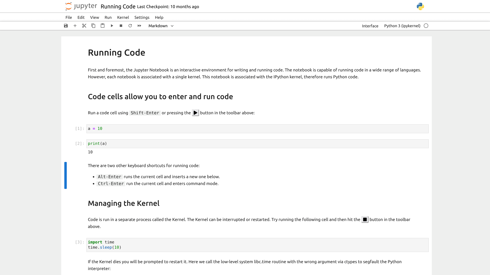

# Introduction

With this Github repository, [Mossé Cyber Security Institute](https://www.mosse-institute.com/) offers you three (3) datasets to practice Threat Hunting.

The datasets contain forensics data for 25, 50 and 75 machines respectively. The answers for dataset 1 have been provided for learning purposes. It will be up to you to discover which machines have been compromised for the other two datasets.

# Getting Started

## Step 1 - Download Anaconda

We strongly recommend that you download and use Anaconda:

* URL: https://www.anaconda.com/

Anaconda offers the easiest way to perform Python data science and machine learning on a single machine.

## Step 2 - Download the required Python Packages

Install Pandas, Pyarrow, and Numpy:

```bash
python -m pip install -r requirements.txt
```

- [Pandas](https://pandas.pydata.org/) is a fast, powerful, flexible and easy to use open source data analysis and manipulation tool, built on top of the Python programming language.

* [Apache Arrow](https://arrow.apache.org/docs/python/index.html) is a development platform for in-memory analytics. It contains a set of technologies that enable big data systems to store, process and move data fast.

- [NumPy](https://numpy.org/doc/stable/) is the fundamental package for scientific computing in Python. It is a Python library that provides a multidimensional array object, various derived objects (such as masked arrays and matrices), and an assortment of routines for fast operations on arrays, including mathematical, logical, shape manipulation, sorting, selecting, I/O, discrete Fourier transforms, basic linear algebra, basic statistical operations, random simulation and much more.

## Step 3 - Use Jupyter Notebook

We recommend that you work in a [Jupyter Notebook](https://jupyter-notebook.readthedocs.io/en/latest/):

Command: `jupyter notebook`



## Step 4 - Bookmark online resources

If you're new to threat hunting and Pandas, then we recommend that you bookmark the following pages:

- [Introduction to Threat Hunting with Python Pandas Video](https://www.youtube.com/watch?v=YS_tT2NfLH0&ab_channel=Moss%C3%A9CyberSecurityInstitute)
- [Pandas User Guide](https://pandas.pydata.org/docs/user_guide/index.html)
- [Pandas API Reference](https://pandas.pydata.org/docs/reference/index.html)
- [Jupyter Notebook](https://jupyter-notebook.readthedocs.io/en/latest/)
- [MCSI Library](https://library.mosse-institute.com/cyber-domains/threat-hunting.html)

**Important: Make sure to watch the introduction video. The first link.**

## Solving Dataset #1

We provide you solutions to identify all the Indicators of Compromise (IOC) in dataset 1.

**Disclaimer:** The solutions provided are designed to be simple. In the real-world, you'll need to engineer smarter ways of detecting attacks.

### Step 1 - Reading the Datasets

Start a Jupyter Notebook and confirm that you can read one of the datasets:

```Python
import pandas as pd
import pyarrow as pa
import pyarrow.parquet as pq

dataset = pq.ParquetDataset('dataset-1/w32services/')
table = dataset.read()
w32services = table.to_pandas()
```

### Step 2 - Identify Path Interception by Unquoted Path

Adversaries may execute their own malicious payloads by hijacking vulnerable file path references. Adversaries can take advantage of paths that lack surrounding quotations by placing an executable in a higher level directory within the path, so that Windows will choose the adversary's executable to launch. ([source](https://attack.mitre.org/techniques/T1574/009/))

Here's how you can find Path Interception IOCs in the first dataset:

```python
search_1 = w32processes[w32processes['name'] == 'Program.exe']

print("> Machines with Path Interception:")
print(search_1[['hostname', 'path', 'arguments']].to_string(index=False))
```

### Step 3 - Identify Procdump.exe

[ProcDump](https://learn.microsoft.com/en-us/sysinternals/downloads/procdump) is a command-line utility whose primary purpose is monitoring an application for CPU spikes and generating crash dumps during a spike that an administrator or developer can use to determine the cause of the spike. ProcDump also includes hung window monitoring (using the same definition of a window hang that Windows and Task Manager use), unhandled exception monitoring and can generate dumps based on the values of system performance counters. It also can serve as a general process dump utility that you can embed in other scripts.

Here's how you find machines where the adversary used procdump to dump the memory of LSASS:

```python
search_2 = w32processes[w32processes['name'] == 'procdump.exe']

print("> Machines with procdump.exe: %d" % len(search_2))
print(search_2[['hostname', 'arguments']].to_string(index=False))
```

### Step 4 - Identify Accessibility Feature backdoors

Adversaries may establish persistence and/or elevate privileges by executing malicious content triggered by accessibility features. Windows contains accessibility features that may be launched with a key combination before a user has logged in (ex: when the user is on the Windows logon screen). An adversary can modify the way these programs are launched to get a command prompt or backdoor without logging in to the system. ([source](https://attack.mitre.org/techniques/T1546/008/))

Here's how you can detect the Accessibility Feature backdoors in the dataset:

```python
search_3 = w32registry[w32registry['valuename'] == 'Debugger']
search_3 = search_3[search_3['keypath'].str.contains('Image File Execution Options')]

print("Machines with Accessibility Features Backdoors:")
print(search_3[['hostname', 'keypath', 'text']].to_string(index=False))
```

# Hints

| Dataset | Hints |
|---------| ------|
| 25 machines | LSASS process dumping, PATH Interception, Accessibility Features Backdoor |
| 50 machines | DLL injection, PowerShell Execution, MSHTA Execution, Regsvr32 Execution |
| 75 machines | |

# Contact Us

We invite you to contact us if you have any questions or would like to report errors with the datasets. Our email is learn@mosse-institute.com

Have fun!